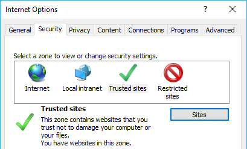
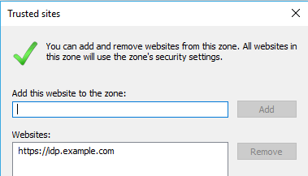
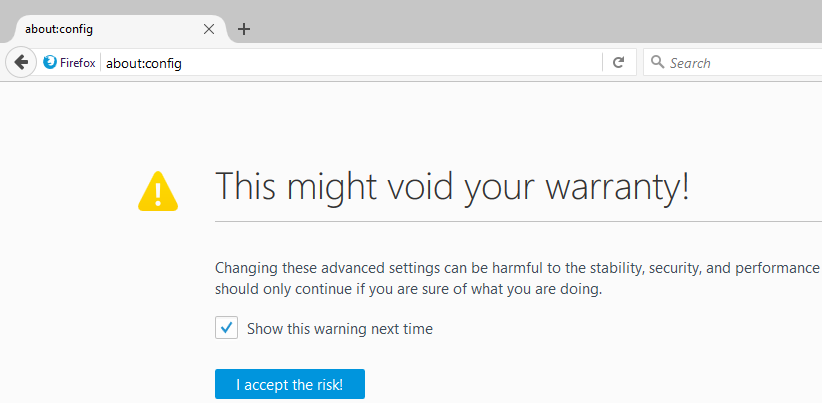
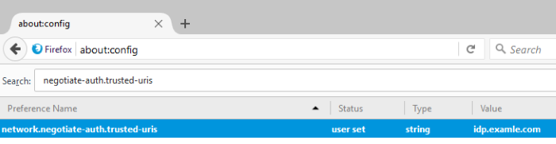

# Negotiate Server

This SimpleSAMLphp module allows for users to authenticate via Apache/IIS integrated "HTTP Negotiate" support. It is roughly
based on the original ["negotiate" module](https://github.com/simplesamlphp/simplesamlphp/blob/master/modules/negotiate/docs/negotiate.md) 
without the **php_krb5** dependency. All authentication (Kerberos/NTLM) processing is done by the web server.
 
`negotiateserver:Negotiate`
: Authenticates users via Apache/IIS integrated "HTTP Negotiate" authentication

## `negotiateserver:Negotiate`
 
The primary goal of this extension is to use your Kerberos session to automaticaly retrieve a corresponding SAML session.
A common use case would be for a network of domain joined workstations to allow seamless login into web services that use
SAML for authentication. A domain user logged into a workstation would not be prompted for credentials
when accessing these web services.

Basic requirements for the server hosting SimpleSAMLphp:
- Apache 2.4 with **mod_auth_kerb**/**mod_auth_gssapi** or IIS 7.0+
  (web server should be joined into a domain)
- SimpleSAMLphp 1.14.x or newer

**Note:** This module has been tested in an environment with Microsoft Active Directory and IIS 8.5
running on Windows Server 2012 R2 and Apache 2.4 on CentOS 7. There can be some issues
with different combinations and/or server versions, but everything should also work on Windows Server from 2008 
onwards and Linux distributions with at least Apache 2.2.

### Installation

This module can be installed via composer:

```
composer require klemenb/simplesamlphp-module-negotiateserver:dev-master
```

Since we depend on web server's handling of "HTTP Negotiate" authentication, we have to manually
add a configuration file into your SimpleSAMLphp's **www** folder or properly edit our virtual host definition.

### Apache configuration

Add the following **&lt;Location&gt;** directive to your **VirtualHost** definition

(Using **mod_auth_kerb**):

```xml
<Location "/module.php/negotiateserver/auth.php">
    AuthName "[MY_ORGANIZATION_NAME] Authentication"
    AuthType Kerberos
    Krb5Keytab /etc/httpd/conf/HTTP.idp.keytab
    KrbMethodNegotiate On
    KrbMethodK5Passwd On
    require valid-user
</Location>
```

(Using the more modern **mod_auth_gssapi**):

```xml
<Location "/module.php/negotiateserver/auth.php">
    AuthName "User with domain part in upper case (ends in '.LOCAL')"
    AuthType GSSAPI
    GssapiBasicAuth On
    GssapiCredStore keytab:/etc/httpd/conf/HTTP.idp.keytab
    require valid-user
</Location>
```

Make sure to properly update the path to your Kerberos keytab file.

An example of a complete **VirtualHost** definition where SimpleSAMLphp is installed
in **/var/www/idp.example.com** is below:

```xml
<VirtualHost *:80>
  DocumentRoot /var/www/idp.example.com/www
  ServerName idp.example.com

  <Directory "/var/www/idp.example.com/www">
    AllowOverride None
    Require all granted
  </Directory>

  <Location "/module.php/negotiateserver/auth.php">
    AuthName "[MY_ORGANIZATION_NAME] Authentication"
    AuthType Kerberos
    Krb5Keytab /etc/httpd/conf/HTTP.idp.keytab
    KrbMethodNegotiate On
    KrbMethodK5Passwd On
    require valid-user
  </Location>

</VirtualHost>
```

### IIS configuration

Create a **web.config** file inside **www** directory of your SimpleSAMLphp installation 
(e.g. /var/www/idp.example.com/www) with below content:

```xml
<?xml version="1.0" encoding="UTF-8"?>
<configuration>
    <location path="module.php/negotiateserver/auth.php">
        <system.webServer>
            <security>
                <authentication>
                    <anonymousAuthentication enabled="false" />
                    <windowsAuthentication enabled="true" />
                </authentication>
            </security>
        </system.webServer>
    </location>
    <system.webServer>
        <serverRuntime authenticatedUserOverride="UseWorkerProcessUser" />       
    </system.webServer>
</configuration>
```

### Module configuration

All **negotiateserver** module configuration is handled in **authsources.php**. Add below entry
to your **$config** array inside **config/authsources.php**:
 
```php
'negotiateserver' => array(
    'negotiateserver:Negotiate',

    // Entry in authsources.php that this module will
    // fallback to in case of an error
    'auth_fallback' => 'ldap',

    // Connection parameters for your Active Directory or LDAP
    // from which user attributes will be retrieved after a successful 
    // user authentication
    'ldap.hostname' => ['127.0.0.1'],
    'ldap.base' => ['OU=Users,OU=Example,DC=example,DC=local'],

    // if you have multiple domains
    // you can use the REALM to do a lookup
    // the REALM matches whatever you put after the '@' sign
    // or before the '\' (backslash)
    /*
    'ldap.hostname' => [
        'EXAMPLE.LOCAL' => 'dc01.example.local',
        'SUB1.EXAMPLE.LOCAL' => 'dc01.sub1.example.local',
        'SUB2.EXAMPLE.LOCAL' => 'dc01.sub2.example.local'
    ],
    'ldap.base' => [
        'EXAMPLE.LOCAL' => 'dc=example,dc=local',
        'SUB1.EXAMPLE.LOCAL' => 'dc=sub1,dc=example,dc=local',
        'SUB2.EXAMPLE.LOCAL' => 'dc=sub2,dc=example,dc=local'
    ],
    */
    
    'ldap.admin_user' => 'admin@example.local',
    'ldap.admin_password' => 'password123',
    'ldap.identifier' => 'sAMAccountName',
    'ldap.referrals' => false,

    // The list of attributes to retrieve from Active Directory or LDAP
    // (leave empty to retrieve all available attributes)
    'attributes' => ['userPrincipalName', 'displayName', 'givenName', 'sn'],

    // Use this module only on the subnets defined below
    // (leave empty to enable it for all requests)
    'subnets' => [
        '10.0.0.0/16',
    ],

    // Use this module only on allowed subnets (or all requests)
    // except for the ones defined below
    'subnets_exclude' => [
        '10.0.5.0/24'
    ]
),
```
   
### Browser configuration

#### Internet Explorer

Internet Explorer uses security zones for distinguishing between different types of web sites. 
To enable integrated windows authentication for your site, you should add it to the **Trusted sites**
security zone.

Navigate to the **Security** tab under **Internet Options**, select **Trusted sites** and click **Sites** button
to open the list.



Add the URL of your identity provider to the list and close the window.




#### Google Chrome

Google Chrome will follow Internet Explorer's settings described above.

#### Mozilla Firefox

To enable HTTP Negotiate authentication in Firefox, navigate to the URL **about:config** and promise to be
careful while changing these advanced settings.



Search for a preference named **network.negotiate-auth.trusted-uris** and add your identity provider to the list.




